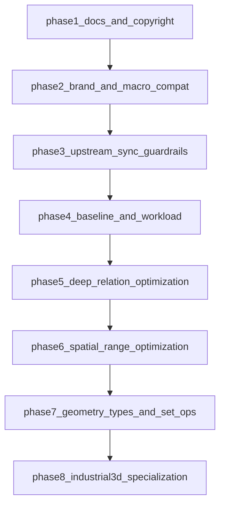

# ZWSQL可执行实施计划

## 目标与原则
- 目标：将当前分支演进为 `ZWSQL`，并围绕“低并发高数据量、深关联、空间与工业三维能力”持续增强。
- 原则：
  - 尽量不做大规模重命名，优先“兼容层+少量入口改动”。
  - 新增能力优先以模块化方式落地，减少对核心路径侵入。
  - 保持可持续向上游 PostgreSQL 同步（cherry-pick/rebase 成本可控）。

## 阶段1（你定义的第一步）：文档与版权信息
- 修改顶层说明文档，明确项目已派生为 ZWSQL：
  - [README.md](README.md)
  - [COPYRIGHT](COPYRIGHT)
- 建议新增单独派生说明文档，避免污染上游原有许可证文本语义：
  - [ZWSQL_DERIVATION.md](ZWSQL_DERIVATION.md)
- 内容要求：
  - 保留 PostgreSQL 原版权声明与许可条款。
  - 增加 ZWSQL 的新增版权声明（年份、组织/个人、范围说明）。
  - 明确“ZWSQL 基于 PostgreSQL 派生，原许可继续有效”。
- 验收标准：
  - 许可证文本合法完整；README 首页可明确区分 PostgreSQL 与 ZWSQL。

## 阶段2（你定义的第二步）：项目名与命名兼容宏
- 先改“展示名/版本字符串”，不改内部符号名：
  - [configure.ac](configure.ac)（`AC_INIT`、`PG_VERSION_STR` 文案）
  - [src/include/pg_config_manual.h](src/include/pg_config_manual.h)（`FMGR_ABI_EXTRA`、`DEFAULT_EVENT_SOURCE`）
  - [README.md](README.md)（项目名展示）
- 新增“品牌与兼容宏”集中入口（建议新增文件）：
  - [src/include/zwsql_compat.h](src/include/zwsql_compat.h)
- 在公共头中引入兼容宏（最小侵入）：
  - [src/include/c.h](src/include/c.h)
- 宏设计建议（示例方向）：
  - 品牌宏：`ZWSQL_PRODUCT_NAME`、`ZWSQL_VERSION_STR`
  - 命名映射宏：仅对外展示字符串、可控 API 别名进行宏映射
  - 禁止策略：不做全局 `#define postgres ...` 或 `#define pg_ ...` 粗暴替换（会放大冲突与上游同步成本）
- 验收标准：
  - `--version`、日志/事件源等可见标识显示 ZWSQL。
  - 核心内部符号和目录结构基本保持 PostgreSQL 原貌。

## 阶段3（补充）：建立“可持续同步上游”的工程护栏
- 新增同步策略文档：
  - [ZWSQL_SYNC_POLICY.md](ZWSQL_SYNC_POLICY.md)
- 约定改动分层：
  - `Upstream-friendly`（可直接同步）
  - `ZWSQL-overlay`（兼容层与新增模块）
  - `Divergent-core`（必须偏离上游的核心改动）
- 建立最小 CI 基线：
  - 编译通过 + 核心回归测试 + 关键路径 smoke test。
- 验收标准：
  - 每次功能变更都能标注所属分层，并具备同步风险评估。

## 阶段4（补充）：性能基线与目标场景建模
- 建立 ZWSQL 目标负载基准（单项目 <=1000 用户、超大数据量、重写入+重查询）。
- 重点观测指标：
  - 深关联查询延迟（P95/P99）
  - 大事务写入吞吐
  - 空间检索耗时与索引命中率
  - 缓存命中与 I/O 放大
- 输出基线报告：
  - [ZWSQL_BASELINE.md](ZWSQL_BASELINE.md)
- 验收标准：
  - 有可复现压测脚本与首版性能瓶颈清单。

## 阶段5（补充）：深关联查询优化（核心）
- 优化方向：
  - 复杂 JOIN/递归路径的统计信息与代价模型增强。
  - 图状关系查询的索引辅助（邻接/层级/路径缓存）。
  - 热点关联路径的执行计划稳定性优化。
- 建议优先在扩展层或可开关路径实现，避免一次性改写优化器主干。
- 验收标准：
  - 典型深关联场景较基线实现明确收益（例如 P95 降低 20%+，以你们数据为准）。

## 阶段6（补充）：空间能力继承与增强
- 目标：完整继承现有空间支持并增强“空间范围查找”。
- 重点：
  - 空间范围查询的索引策略（2D/3D bbox 过滤 + 精确计算）。
  - 时空复合查询（可选）为工业场景预留。
- 验收标准：
  - 范围查询正确性、性能、稳定性通过固定数据集验证。

## 阶段7（补充）：几何基础类型与集合运算函数
- 新增（或增强）几何基础数据类型与函数族：
  - 并、交、差、包含、相交、接触、距离等。
- 设计原则：
  - 明确容差模型与数值稳定性策略。
  - 先实现最小可用函数集合，再扩展高阶函数。
- 验收标准：
  - 类型 I/O、运算正确性、边界条件（退化几何）测试齐全。

## 阶段8（补充）：工业三维专项优化（建议路线）
- 拓扑关系索引：点线面体与装配体的邻接/包含/接触关系快速判定。
- 装配树与 BOM 查询加速：多层结构递归展开、影响范围追踪。
- 多版本模型增量存储：对象级 diff/merge，降低全量快照成本。
- 多分辨率（LOD）查询：浏览与分析按精度分层读取。
- 网格与仿真结果块化存储：支持局部区域与时间步切片查询。
- 验收标准：
  - 每个专项至少有一个可量化 benchmark 与可回归测试。

## 执行顺序图

## 每阶段交付节奏（建议）
- 每阶段固定输出：设计说明 + 代码 + 回归测试 + 基准结果 + 同步风险说明。
- 每阶段结束前做一次“上游同步演练”（至少 dry-run 级别），避免债务堆积。